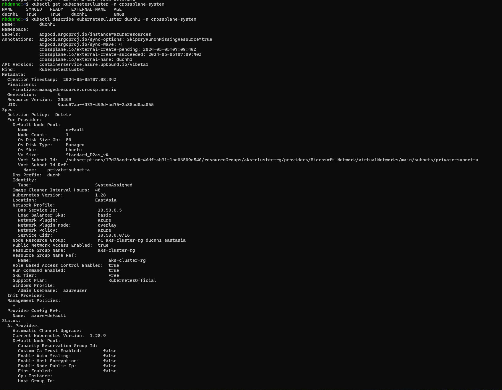

## Azure Provider Crossplane

1. Authentication: 
Using Service Principal. You can create it in the portal or by CLI

```bash
SUBSCRIPTION_ID=

az ad sp create-for-rbac \
--sdk-auth \
--role Owner \
--scopes /subscriptions/
```

2. Create a Secret for ProviderConfig
Configure your credentials file according to `azure.json`

```bash
kubectl create secret generic azure-secret -n crossplane-system --from-file=creds=azure.json
```

3. Create an Application
```bash
cat << EOF | kubectl apply -f - 
apiVersion: argoproj.io/v1alpha1
kind: Application
metadata:
  name: azureresources
  namespace: argocd
spec:
  project: crossplane
  source:
    repoURL: https://github.com/nhd1207/argocd-crossplane.git
    targetRevision: HEAD
    path: azure
    directory:
      recurse: false
      include: '*.yaml'
  destination:
    server: "https://kubernetes.default.svc"
    namespace: crossplane-system
  syncPolicy:
    automated: {}
EOF
```


### Result





