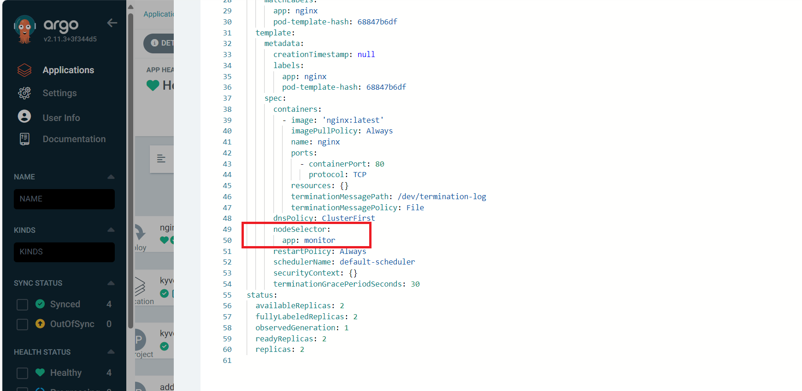

## Deploy Kyverno

Run the following command to deploy an Kyverno Application 
```bash
cat << EOF | kubectl apply -f - 
apiVersion: argoproj.io/v1alpha1
kind: Application
metadata:
  name: kyverno
  namespace: argocd
spec:
  project: default
  source:
    repoURL: https://github.com/nhd1207/argocd-crossplane.git
    targetRevision: HEAD
    path: kyverno
    directory:
      recurse: false
      include: '*.yaml'
  destination:
    server: "https://kubernetes.default.svc"
    namespace: argocd
  syncPolicy:
    automated: {}
EOF
```

## Result:
After deploying Kyverno:


Create a policy to add node selector 


Pods are automatically added node-selector due to policy:


Pod creation is denied due to violate policy DisAllow Default Namespace
